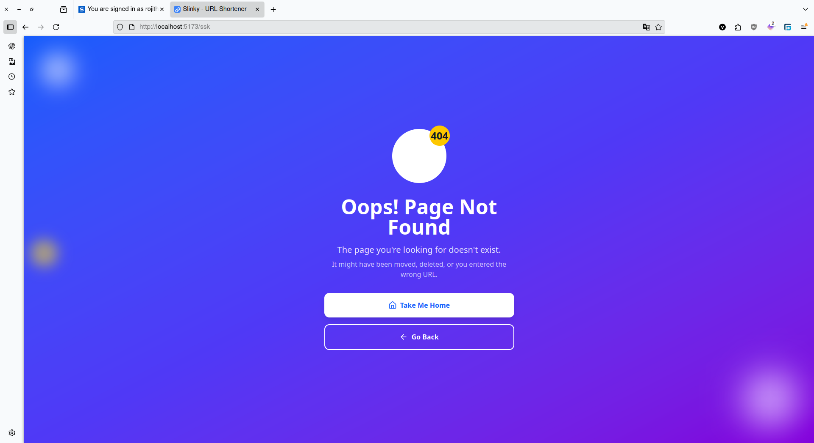

# 🔗 SLinky - URL Shortener
## A simple URL shortener built with **React (Vite)** and styled using **Tailwind CSS**. Easily convert long URLs into short, shareable links.

## ✨ Features

- 🔗 Shorten long URLs
- 📋 Copy shortened URLs to clipboard
- ⚡ Fast and modern UI with Tailwind + Vite

## 🛠️ Tech Stack

- **Frontend**: [Vite](https://vitejs.dev/), [React](https://reactjs.org/), [Tailwind CSS](https://tailwindcss.com/)
- **Backend**: [Express.js](https://expressjs.com/) (Node.js - v22.15.1)
- **Databse**: [Mongo DB](https://www.mongodb.com/)  v8.0.10

---

## 🔴 Live Demo : [click here](https://slinky-frontend.vercel.app/)

## 👨🏻‍💻 Setup :

### Clone the Repo : 

```javascript

  # Clone the repository
  git clone --depth=1 https://github.com/vishwaravi/slinky.git

```

### Backend Setup

```javascript

  cd slinky/backend

  # Install dependencies
  npm install

  # Run the Server
  npm run dev

```
> Make Sure you Configure the env variables in the `.env` file.

### Frontend Setup :

```javascript

  cd slinky/frontend

  # Install dependencies
  npm install

  # Run the Client
  npm run dev

```

### Environment Variables


#### Frontend

```javascript

# BACKEND API URL
VITE_API_URL=http://localhost:5000

```

#### Backend 

```javascript

# Environment variables for local development
# Copy this file to .env and fill in your actual values

# Database
MONGODB_URI=mongodb://localhost:27017/slinky

# Server
PORT=5000

# CORS
CORS_ORIGIN=http://localhost:5173

```
---
## API End Points :

### `POST /short`

- Description : short a url.
- Request :

  ```json
  {
    "originalUrl" : "https://example.com/posts"
  }
  ```
- Response :
  - `201 CREATED`

    ```json
    {
      "url": "w1NLk64" //uri
    }
    ```
---
### `GET /:uri`
- Description : Redirects to the destination Site

---

### 📸  Screen Shots

#### Home Page


#### About Page


#### Not Found Page



## 📄 License

This project is licensed under the [MIT License](LICENSE).

---

### 🚀 Give Star if you like this

